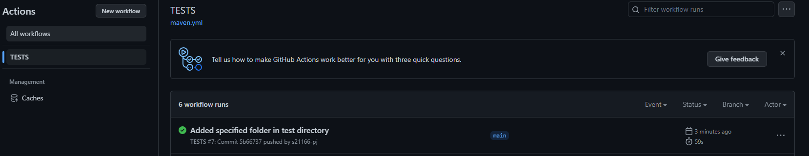
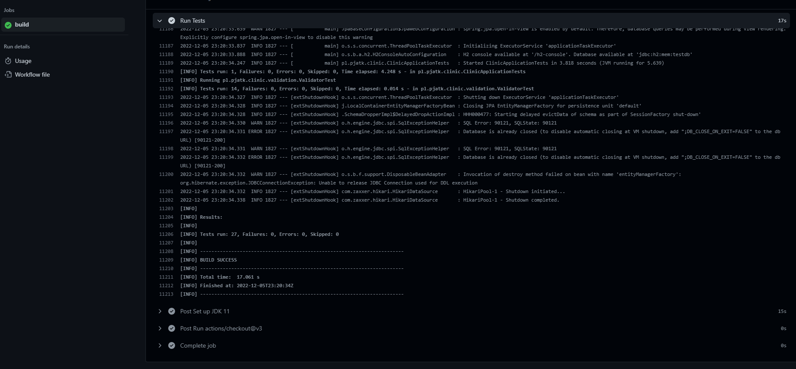

# github actions

Desc: 
- workflow name: `Java CI with Maven test`
- link: `https://github.com/s21166-pj/TAU/blob/main/.github/workflows/maven.yml`
- above workflow runs tests from previous exercise under `4` directory

